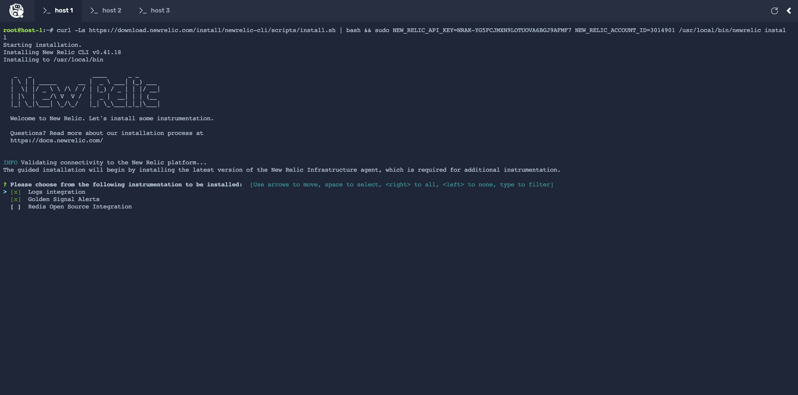

With your app now running on distributed infrastructure, your goal is to monitor your infrastructure to identify and mitigate any issues, as needed. To achieve your goal, instrument your hosts with New Relic infrastructure agent to gain insights into your infrastructure.

## Install New Relic infrastructure agent

With New Relic infrastructure, you get complete observability of your system. You can monitor the health and performance of all your hosts and identify any degradation in your system. This allow you to take in-time action and mitigate issues with your infrastructure before they affect your users.

To observe your infrastructure in New Relic, you first need to install New Relic infrastructure agent on your hosts. The easiet way is to use guided install.

Open a new tab in your browser and go to [New Relic One](https://one.newrelic.com). In the top-right, click on **Add more data**.

Scroll down to **Host Operating Systems** and choose **Ubuntu**.

On the next page, click **Begin Installation**.

Here, you see the installation instruction.

Copy it to the terminal window of **host 1** to begin installaing the infrastructure agent.

The guided install discovers and recommends integrations appropriate for your system. However, we're only sticking to _Logs integration_ and _Golden Signal Alerts_ instrumentation.

The installation will take a few minutes to complete. Meanwhile, move to **host 2** and install the infrastructure agent.

- Note: New Relic infrastructure agent can be installed on several hosts simultaneously. Instead of going through the whole process again, you execute the same command on **host 2** to install the infrastructure agent.

Once the installation finishes, you see your hosts in New Relic.

## View your infrastructure

Once you install the New Relic infrastructure agent on your hosts, you see them in New Relic.

In [New Relic One](https://one.newrelic.com), go to **Hosts** in left hand menu.

Here, you see a list of all your hosts. This view also shows you important statistics like **CPU usage**, **Memory usage**, **Storage usage**, about your hosts so you have a quick glance of your infrastructure.

- Note: The above screenshot shows the new **Host** view. If you're using the old view, toggle the **Show new view** button in top right corner to switch to new **Host** view before proceeding.

With New Relic infrastructure agent now installed on your hosts, you observe and monitor the system for any degradation when occurs.