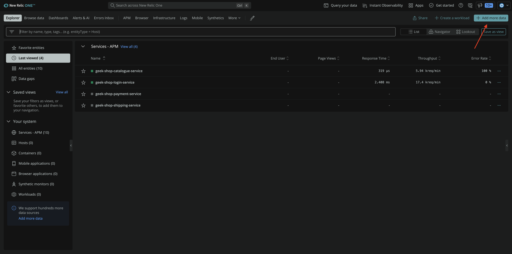
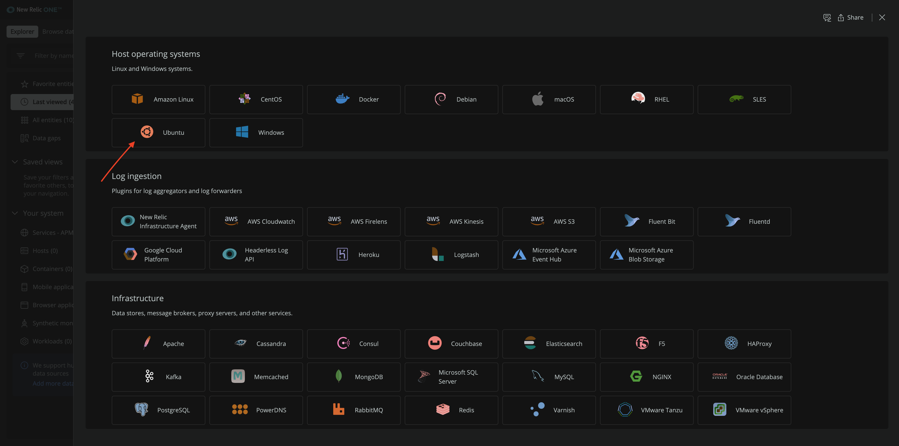
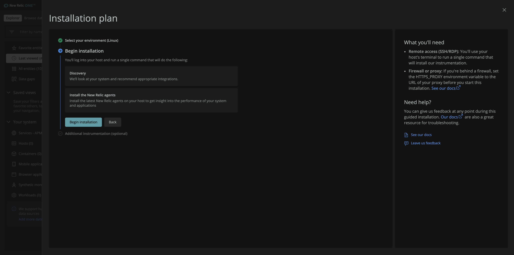
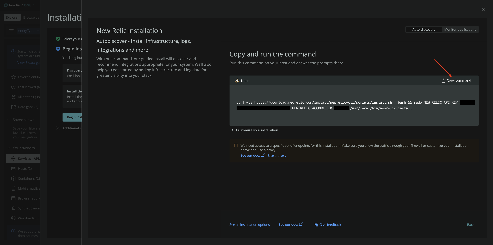
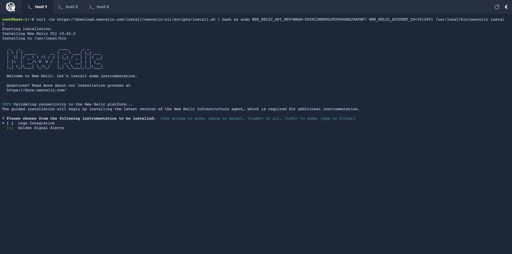
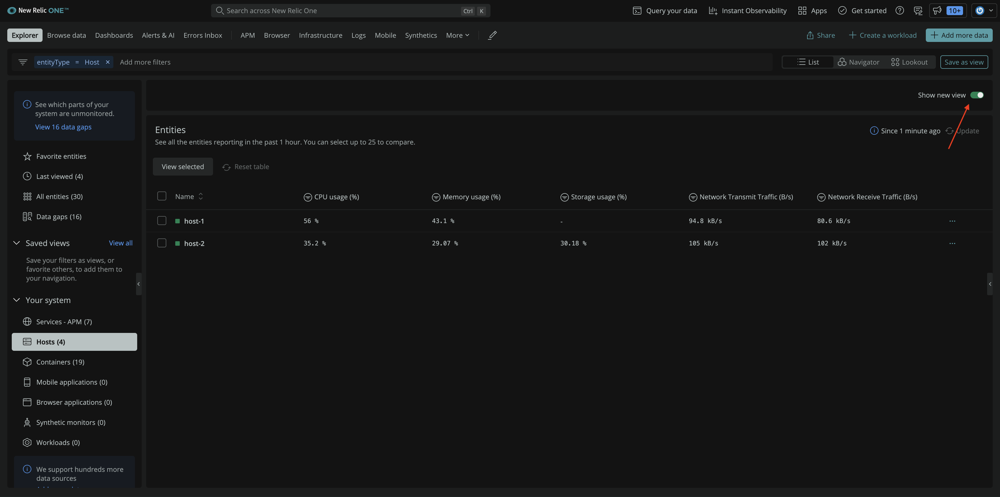

With infrastructure monitoring, you can observe your entire system. You can monitor the health and performance of all your hosts and identify issues that arise within them. With this information, you can take actions to mitigate the issues.

To gain these valuable insights, instrument your hosts with our infrastructure agent.

## Install our infrastructure agent

Open a new tab in your browser and go to [New Relic](https://one.newrelic.com).

In the top-right, click on **Add more data**.

Scroll down to **Host Operating Systems** and choose **Ubuntu**.

The hosts that serve your application are running the Ubuntu operating system.

On the next page, click **Begin Installation**.

Copy the command and run it on **host 1** to install the infrastructure agent.

The guided install discovers and recommends integrations appropriate for your system. For now, only select **Golden Signal Alerts** instrumentation.

> To deselect an integration, arrow down and press SPACE

Golden Signal Alerts will setup alerts for any existing, and futute, entities reporting to newrelic with Golden Signal conditions:

  - High CPU
  - High Application Error Rate
  - High Application Response Time
  - Low Application Throughput

In real-world scenarios, you approve your email to be notified if and when these alerts trigger. Since this is a lab, you choose otherwise.

The installation takes a few minutes to complete. While it does, do the same for **host 2**.

> **Note:** You can install our infrastructure agent on multiple hosts, simultaneously. Just paste the same command you did for **host 1** onto **host 2**.

## View your infrastructure

Once you install our infrastructure agent on your hosts, you see them in New Relic.

In [New Relic](https://one.newrelic.com), go to **Hosts** in the left-hand menu.

> **Note:** This screenshot shows the new **Host** view. If you're using the old view, toggle the **Show new view** button in top right corner to switch to the new **Host** view before proceeding.
>
> 

Here, you see a list of all your hosts. This view also shows you important statistics about your hosts, like **CPU usage**, **Memory usage**, and **Storage usage**.

With our infrastructure agent installed on your hosts, it's time to observe your system.
