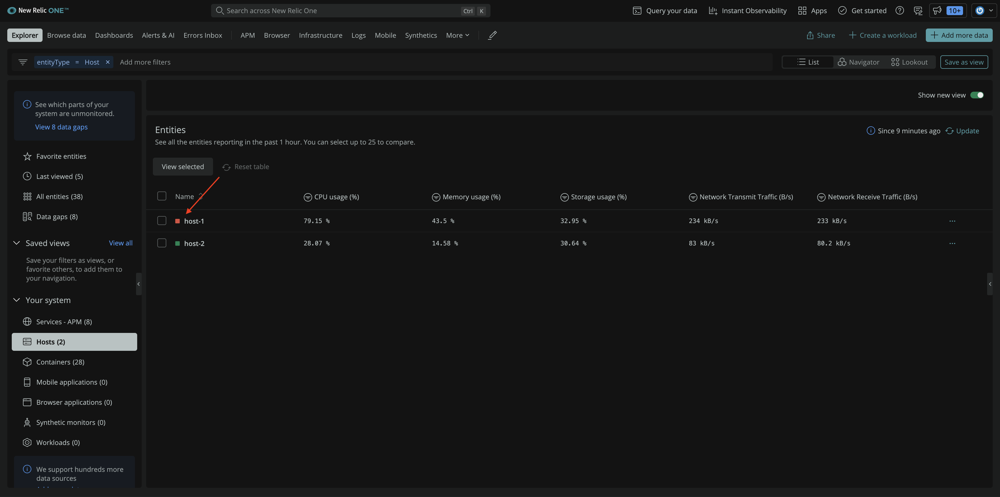
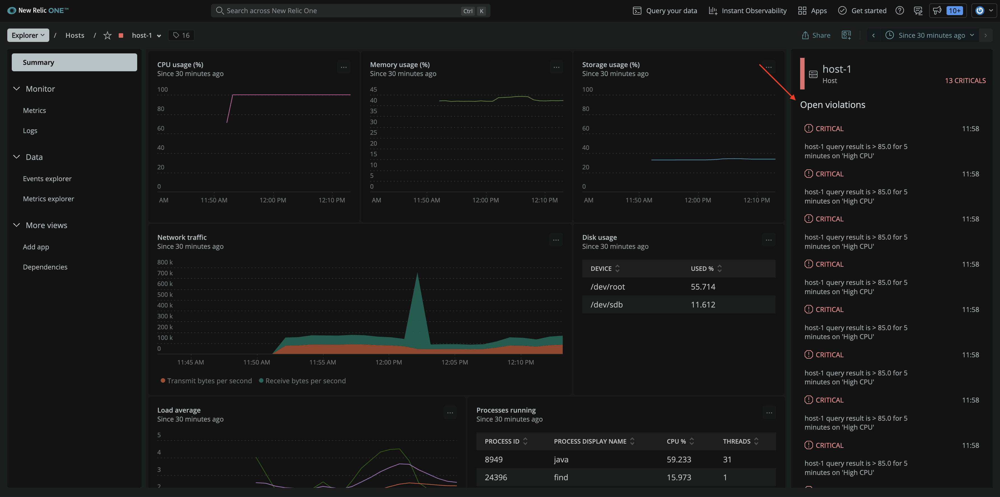
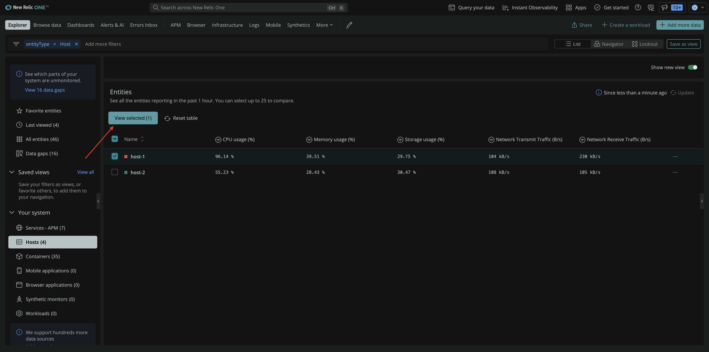
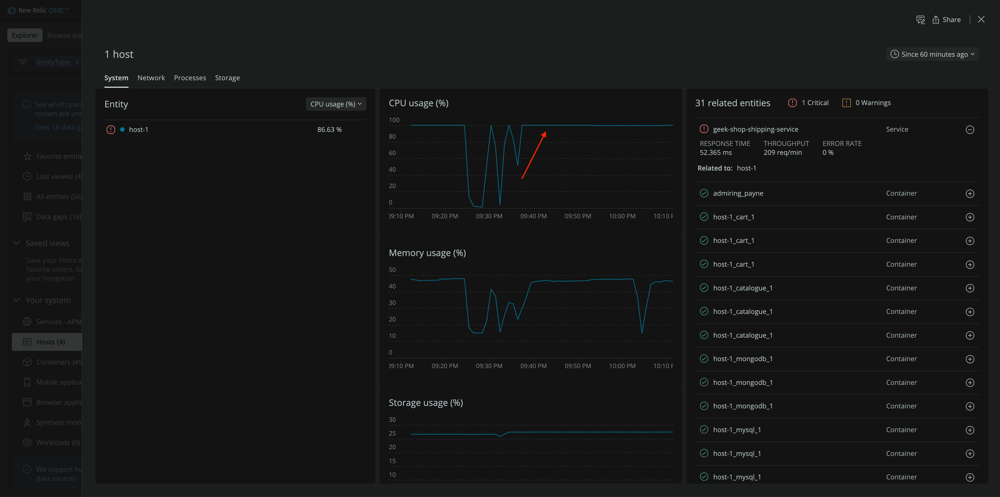
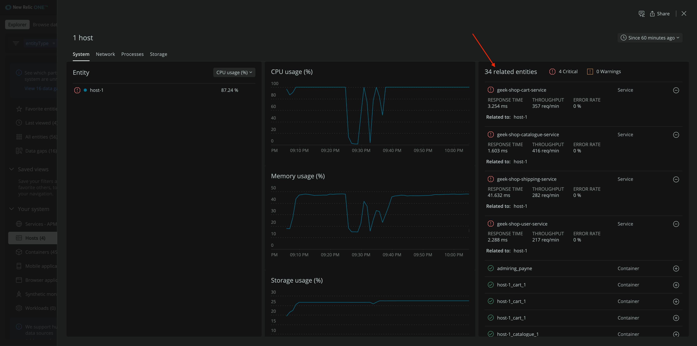
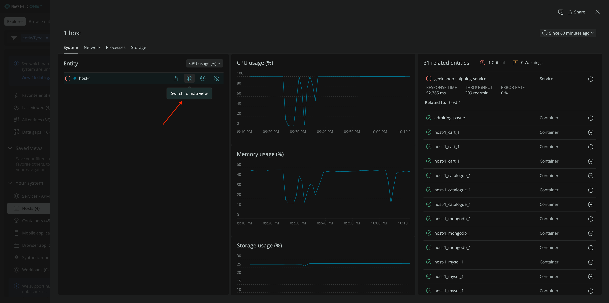
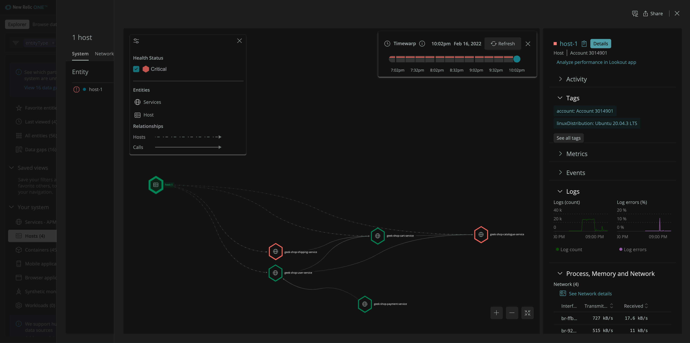

With infrastructure monitoring, you can quickly identify issues in your system as well as the entities that are affected by those issues.

## Identify depleted resources

Go to [New Relic](https://one.newrelic.com) and select **Hosts** from left-hand menu.

Here, you see a list of your hosts.

Notice that **host-1** is marked red which tells you that a critical violation is in progress. Click **host-1** to take a closer look.

> **Note:** If **host-1** isn't marked red yet, wait a few more minutes, and refresh your view.

In the right hand panel, you see **Open violations**.

You see that your host was firing Golden Signal 'High CPU' alert. You need to understand if this high utilization is temporary or a long-lasting issue.

From **Hosts** view, select **host-1** and click **View selected**.

This view shows you details about your host, including the same usage statistics you saw in the previous view. But now, you also see a timeseries graph that proves your host has been running your CPU dry for a while!

Now that you know this is an actual problem, you need to determine what entities are affected by this issue.

## Determine the impact radius

Now that you've confirmed that high CPU usage is an issue on your host, you need to determine how many related entities are affected. This helps you prioritize mitigating the issue.

On the host's detail page, you see the host's related entities.

Our infrastructure agent automatically discovers the related entities and maps their relationships. If you don't see any related entities, allow the agent a few more minutes to discover them.
Once you see the services under related entities, switch to map view.

This shows all the services running on this host.

The shipping and catalogue services are in critical condition; that's what the red color indicates. These services are crucial for your site operations, so most of your customers will be impacted by these service issues.

Now that you understand the CPU utilization issue and its impact radius, you need to discover the root cause of the issue so you can quickly mitigate the situation and ensure a smooth experience for your customers.
