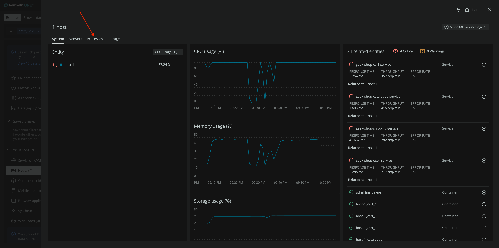
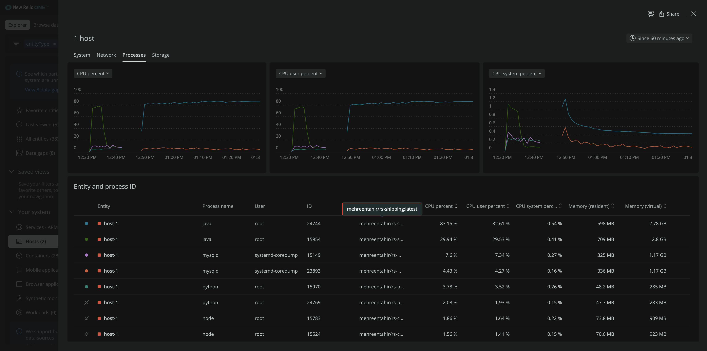

You discovered that your host uses a lot of CPU. To understand why, look at its running processes.

From the host's detail page, switch your view from **System** to **Processes**.

Here, you see information about processes running on your host, including their identifiers, containers, CPU utilization percentages, and more. Click **CPU percent** to order them by descending CPU percentage.

The top process that's using a lot of CPU is a Java process.

Hover over the container on that java process in the **Container** column.

This shows you that the container holding the high CPU process is for your shipping service. The shipping service is a Java application that has logic that consumes a high percentage of CPU. This process's resource consumption is reflected on your host and also on dependent services.

Now that you've discovered the root cause of high CPU utilization on your host, you can pass this information to the development team responsible for the shipping service.

## Summary

Congratulations! You used infrastructure monitoring to discover an issue and its root cause on your host.

Specifically, you:

- Instrumented your hosts with our infrastructure agent
- Monitored your infrastructure for issues, and found a host that used a lot of its CPU
- Discovered the root cause of that issue within the Geek's Movie Shop shipping service

## Homework

Now that you know how to instrument your infrastructure with New Relic, here are some resources you can utilize to familiarize yourself even more with infrastructure monitoring.

- [Get started with infrastructure monitoring] (https://docs.newrelic.com/docs/infrastructure/infrastructure-monitoring/get-started/get-started-infrastructure-monitoring/)
- [New infrastructure hosts UI](https://docs.newrelic.com/docs/infrastructure/infrastructure-ui-pages/infrastructure-ui-entities)